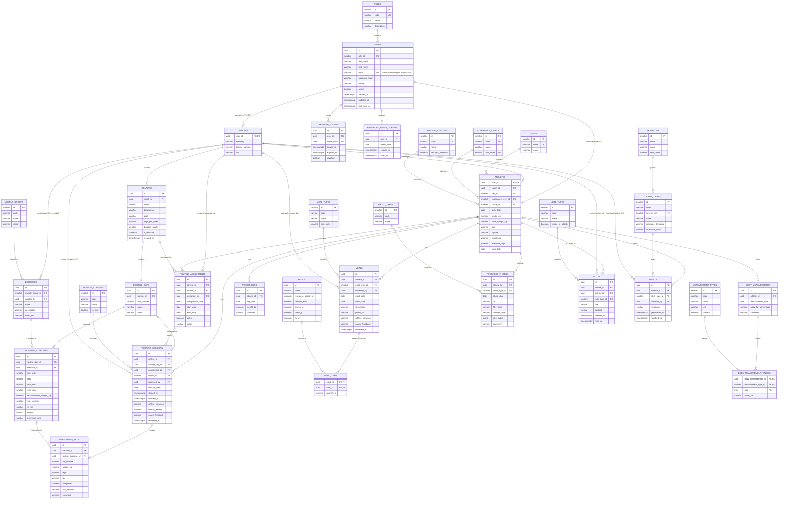

# DER — Mermaid (`erDiagram`)

App de Gestión Deportiva · 33 tablas · BCNF · PostgreSQL

```mermaid
erDiagram
    %% ============ A · IDENTIDAD, ROLES Y ACCESO ============
    ROLES ||--o{ USERS : classifies
    USERS ||--o| COACHES : "specializes (PK=FK)"
    USERS ||--o| ATHLETES : "specializes (PK=FK)"
    USERS ||--o{ REFRESH_TOKENS : issues
    USERS ||--o{ PASSWORD_RESET_TOKENS : requests
    COACHES ||--o{ ATHLETES : manages
    SEXES ||--o{ ATHLETES : classifies
    EXPERIENCE_LEVELS ||--o{ ATHLETES : classifies
    ATHLETE_STATUSES ||--o{ ATHLETES : classifies

    %% ============ B · PLANIFICACION ============
    COACHES ||--o{ ROUTINES : creates
    COACHES ||--o{ EXERCISES : "contributes (NULL = global)"
    COACHES ||--o{ ROUTINE_ASSIGNMENTS : "assigns (assigned_by)"
    ROUTINES ||--|{ ROUTINE_DAYS : contains
    ROUTINE_DAYS ||--|{ ROUTINE_EXERCISES : contains
    MUSCLE_GROUPS ||--o{ EXERCISES : classifies
    EXERCISES ||--o{ ROUTINE_EXERCISES : "is planned in"
    ATHLETES ||--o{ ROUTINE_ASSIGNMENTS : receives
    ROUTINES ||--o{ ROUTINE_ASSIGNMENTS : "is assigned in"

    %% ============ C · EJECUCION REGISTRADA ============
    ATHLETES ||--o{ TRAINING_SESSIONS : logs
    ROUTINE_DAYS ||--o{ TRAINING_SESSIONS : "is the plan of"
    ROUTINE_ASSIGNMENTS ||--o{ TRAINING_SESSIONS : frames
    SESSION_STATUSES ||--o{ TRAINING_SESSIONS : classifies
    COACHES ||--o{ TRAINING_SESSIONS : "reviews (reviewed_by)"
    TRAINING_SESSIONS ||--|{ PERFORMED_SETS : contains
    ROUTINE_EXERCISES ||--o{ PERFORMED_SETS : "is the plan of"

    %% ============ D · ALIMENTACION ============
    ATHLETES ||--o{ MEALS : logs
    MEAL_TYPES ||--o{ MEALS : classifies
    COACHES ||--o{ MEALS : "reviews (reviewed_by)"
    MEALS ||--o{ MEAL_ITEMS : "breaks down into"
    FOODS ||--o{ MEAL_ITEMS : "appears in"

    %% ============ E · PROGRESO FISICO ============
    ATHLETES ||--o{ WEIGHT_LOGS : logs
    ATHLETES ||--o{ BODY_MEASUREMENTS : logs
    BODY_MEASUREMENTS ||--|{ BODY_MEASUREMENT_VALUES : details
    MEASUREMENT_TYPES ||--o{ BODY_MEASUREMENT_VALUES : defines
    ATHLETES ||--o{ PROGRESS_PHOTOS : uploads
    PHOTO_TYPES ||--o{ PROGRESS_PHOTOS : classifies

    %% ============ F · COMUNICACION Y ALERTAS ============
    ATHLETES ||--o{ NOTES : "is subject of"
    COACHES ||--o{ NOTES : "writes (author_id)"
    NOTE_TYPES ||--o{ NOTES : classifies
    ATHLETES ||--o{ ALERTS : triggers
    ALERT_TYPES ||--o{ ALERTS : types
    SEVERITIES ||--o{ ALERT_TYPES : grades
    COACHES ||--o{ ALERTS : "handles (handled_by)"

    %% ==================== TABLAS ====================
    ROLES {
        smallint id PK
        varchar code UK
        varchar name
        varchar description
    }
    USERS {
        uuid id PK
        smallint role_id FK
        varchar first_name
        varchar last_name
        varchar email UK "unico sin distinguir mayusculas"
        varchar password_hash
        varchar phone
        boolean active
        timestamptz created_at
        timestamptz updated_at
        timestamptz last_login_at
    }
    COACHES {
        uuid user_id PK, FK
        varchar specialty
        varchar license_number
        varchar bio
    }
    ATHLETES {
        uuid user_id PK, FK
        uuid coach_id FK
        smallint sex_id FK
        smallint experience_level_id FK
        smallint status_id FK
        date birth_date
        numeric height_cm
        numeric initial_weight_kg
        varchar goal
        varchar injuries
        varchar limitations
        smallint available_days
        date start_date
    }
    REFRESH_TOKENS {
        uuid id PK
        uuid user_id FK
        char token_hash UK
        timestamptz issued_at
        timestamptz expires_at
        boolean revoked
    }
    PASSWORD_RESET_TOKENS {
        uuid id PK
        uuid user_id FK
        char token_hash
        timestamptz expires_at
        timestamptz used_at
    }
    SEXES {
        smallint id PK
        varchar code UK
        varchar name
    }
    EXPERIENCE_LEVELS {
        smallint id PK
        varchar code UK
        varchar name
        smallint sort_order UK
    }
    ATHLETE_STATUSES {
        smallint id PK
        varchar code UK
        varchar name
        boolean requires_attention
    }
    ROUTINES {
        uuid id PK
        uuid coach_id FK
        varchar name
        varchar description
        varchar goal
        smallint days_per_week
        smallint duration_weeks
        boolean is_template
        timestamptz created_at
    }
    ROUTINE_DAYS {
        uuid id PK
        uuid routine_id FK
        smallint day_number
        varchar name
        varchar notes
    }
    EXERCISES {
        uuid id PK
        smallint muscle_group_id FK
        uuid created_by FK
        varchar name
        varchar description
        varchar video_url
    }
    MUSCLE_GROUPS {
        smallint id PK
        varchar code
        varchar name
        varchar region
    }
    ROUTINE_EXERCISES {
        uuid id PK
        uuid routine_day_id FK
        uuid exercise_id FK
        smallint sort_order
        smallint sets
        smallint reps_min
        smallint reps_max
        numeric recommended_weight_kg
        smallint rest_seconds
        varchar rir_rpe
        varchar tempo
        varchar technique_note
    }
    ROUTINE_ASSIGNMENTS {
        uuid id PK
        uuid athlete_id FK
        uuid routine_id FK
        uuid assigned_by FK
        date assignment_date
        date start_date
        date end_date
        boolean active
        varchar notes
    }
    TRAINING_SESSIONS {
        uuid id PK
        uuid athlete_id FK
        uuid routine_day_id FK
        uuid assignment_id FK
        smallint status_id FK
        uuid reviewed_by FK
        date session_date
        timestamptz started_at
        timestamptz finished_at
        varchar athlete_comment
        smallint overall_feeling
        varchar coach_feedback
        timestamptz reviewed_at
    }
    SESSION_STATUSES {
        smallint id PK
        varchar code
        varchar name
        boolean is_final
    }
    PERFORMED_SETS {
        uuid id PK
        uuid session_id FK
        uuid routine_exercise_id FK
        smallint set_number
        numeric weight_kg
        smallint reps
        varchar rpe
        boolean completed
        varchar skip_reason
        varchar comment
    }
    MEALS {
        uuid id PK
        uuid athlete_id FK
        smallint meal_type_id FK
        uuid reviewed_by FK
        date meal_date
        time meal_time
        varchar description
        varchar photo_url
        varchar athlete_comment
        varchar coach_feedback
        timestamptz reviewed_at
    }
    MEAL_TYPES {
        smallint id PK
        varchar code
        varchar name
        smallint sort_order
    }
    MEAL_ITEMS {
        uuid meal_id PK, FK
        uuid food_id PK, FK
        numeric quantity_g
    }
    FOODS {
        uuid id PK
        varchar name
        numeric reference_portion_g
        numeric calories_kcal
        numeric protein_g
        numeric carbs_g
        numeric fat_g
    }
    WEIGHT_LOGS {
        uuid id PK
        uuid athlete_id FK
        date log_date
        numeric weight_kg
        varchar comment
    }
    BODY_MEASUREMENTS {
        uuid id PK
        uuid athlete_id FK
        date measurement_date
        numeric body_fat_percentage
        varchar comment
    }
    BODY_MEASUREMENT_VALUES {
        uuid body_measurement_id PK, FK
        smallint measurement_type_id PK, FK
        char side PK
        numeric value_cm
    }
    MEASUREMENT_TYPES {
        smallint id PK
        varchar code
        varchar name
        varchar unit
        boolean bilateral
    }
    PROGRESS_PHOTOS {
        uuid id PK
        uuid athlete_id FK
        smallint photo_type_id FK
        date photo_date
        varchar url
        varchar file_name
        varchar content_type
        bigint size_bytes
        varchar comment
    }
    PHOTO_TYPES {
        smallint id PK
        varchar code
        varchar name
    }
    NOTES {
        uuid id PK
        uuid athlete_id FK
        uuid author_id FK
        smallint note_type_id FK
        varchar title
        varchar content
        timestamptz created_at
        timestamptz read_at
    }
    NOTE_TYPES {
        smallint id PK
        varchar code
        varchar name
        boolean visible_to_athlete
    }
    ALERTS {
        uuid id PK
        uuid athlete_id FK
        smallint alert_type_id FK
        uuid handled_by FK
        varchar message
        timestamptz generated_at
        timestamptz handled_at
    }
    ALERT_TYPES {
        smallint id PK
        varchar code
        smallint severity_id FK
        varchar name
        varchar message_template
        smallint threshold_days
    }
    SEVERITIES {
        smallint id PK
        varchar code
        varchar name
        smallint sort_order
    }
```
