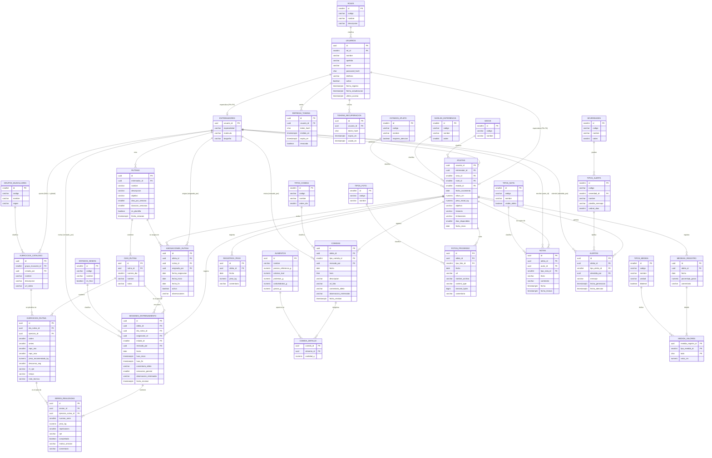

# DER — Mermaid (`erDiagram`)

App de Entrenadores y Atletas · 33 tablas · BCNF · PostgreSQL

```mermaid
erDiagram
    %% ============ A · IDENTIDAD, ROLES Y ACCESO ============
    ROLES ||--o{ USUARIOS : clasifica
    USUARIOS ||--o| ENTRENADORES : "especializa (PK=FK)"
    USUARIOS ||--o| ATLETAS : "especializa (PK=FK)"
    USUARIOS ||--o{ REFRESH_TOKENS : emite
    USUARIOS ||--o{ TOKENS_RECUPERACION : solicita
    ENTRENADORES ||--o{ ATLETAS : gestiona
    SEXOS ||--o{ ATLETAS : clasifica
    NIVELES_EXPERIENCIA ||--o{ ATLETAS : clasifica
    ESTADOS_ATLETA ||--o{ ATLETAS : clasifica

    %% ============ B · PLANIFICACION ============
    ENTRENADORES ||--o{ RUTINAS : crea
    ENTRENADORES ||--o{ EJERCICIOS_CATALOGO : "aporta (NULL = global)"
    ENTRENADORES ||--o{ ASIGNACIONES_RUTINA : "asigna (asignada_por)"
    RUTINAS ||--|{ DIAS_RUTINA : contiene
    DIAS_RUTINA ||--|{ EJERCICIOS_RUTINA : contiene
    GRUPOS_MUSCULARES ||--o{ EJERCICIOS_CATALOGO : clasifica
    EJERCICIOS_CATALOGO ||--o{ EJERCICIOS_RUTINA : "se planifica en"
    ATLETAS ||--o{ ASIGNACIONES_RUTINA : recibe
    RUTINAS ||--o{ ASIGNACIONES_RUTINA : "se asigna en"

    %% ============ C · EJECUCION REGISTRADA ============
    ATLETAS ||--o{ SESIONES_ENTRENAMIENTO : registra
    DIAS_RUTINA ||--o{ SESIONES_ENTRENAMIENTO : "es el plan de"
    ASIGNACIONES_RUTINA ||--o{ SESIONES_ENTRENAMIENTO : "encuadra"
    ESTADOS_SESION ||--o{ SESIONES_ENTRENAMIENTO : clasifica
    ENTRENADORES ||--o{ SESIONES_ENTRENAMIENTO : "revisa (revisado_por)"
    SESIONES_ENTRENAMIENTO ||--|{ SERIES_REALIZADAS : contiene
    EJERCICIOS_RUTINA ||--o{ SERIES_REALIZADAS : "es el plan de"

    %% ============ D · ALIMENTACION ============
    ATLETAS ||--o{ COMIDAS : registra
    TIPOS_COMIDA ||--o{ COMIDAS : clasifica
    ENTRENADORES ||--o{ COMIDAS : "revisa (revisado_por)"
    COMIDAS ||--o{ COMIDA_DETALLE : desglosa
    ALIMENTOS ||--o{ COMIDA_DETALLE : "aparece en"

    %% ============ E · PROGRESO FISICO ============
    ATLETAS ||--o{ REGISTROS_PESO : registra
    ATLETAS ||--o{ MEDIDAS_REGISTRO : registra
    MEDIDAS_REGISTRO ||--|{ MEDIDA_VALORES : detalla
    TIPOS_MEDIDA ||--o{ MEDIDA_VALORES : define
    ATLETAS ||--o{ FOTOS_PROGRESO : sube
    TIPOS_FOTO ||--o{ FOTOS_PROGRESO : clasifica

    %% ============ F · COMUNICACION Y ALERTAS ============
    ATLETAS ||--o{ NOTAS : "es sujeto de"
    ENTRENADORES ||--o{ NOTAS : "escribe (autor_id)"
    TIPOS_NOTA ||--o{ NOTAS : clasifica
    ATLETAS ||--o{ ALERTAS : genera
    TIPOS_ALERTA ||--o{ ALERTAS : tipifica
    SEVERIDADES ||--o{ TIPOS_ALERTA : gradua
    ENTRENADORES ||--o{ ALERTAS : "atiende (atendida_por)"

    %% ==================== TABLAS ====================
    ROLES {
        smallint id PK
        varchar codigo
        varchar nombre
        varchar descripcion
    }
    USUARIOS {
        uuid id PK
        smallint rol_id FK
        varchar nombre
        varchar apellido
        varchar email
        char password_hash
        varchar telefono
        boolean activo
        timestamptz fecha_registro
        timestamptz fecha_actualizacion
        timestamptz ultimo_acceso
    }
    ENTRENADORES {
        uuid usuario_id PK
        varchar especialidad
        varchar matricula
        varchar biografia
    }
    ATLETAS {
        uuid usuario_id PK
        uuid entrenador_id FK
        smallint sexo_id FK
        smallint nivel_id FK
        smallint estado_id FK
        date fecha_nacimiento
        numeric altura_cm
        numeric peso_inicial_kg
        varchar objetivo
        varchar lesiones
        varchar limitaciones
        smallint dias_disponibles
        date fecha_inicio
    }
    REFRESH_TOKENS {
        uuid id PK
        uuid usuario_id FK
        char token_hash
        timestamptz emitido_en
        timestamptz expira_en
        boolean revocado
    }
    TOKENS_RECUPERACION {
        uuid id PK
        uuid usuario_id FK
        char token_hash
        timestamptz expira_en
        timestamptz usado_en
    }
    SEXOS {
        smallint id PK
        varchar codigo
        varchar nombre
    }
    NIVELES_EXPERIENCIA {
        smallint id PK
        varchar codigo
        varchar nombre
        smallint orden
    }
    ESTADOS_ATLETA {
        smallint id PK
        varchar codigo
        varchar nombre
        boolean requiere_atencion
    }
    RUTINAS {
        uuid id PK
        uuid entrenador_id FK
        varchar nombre
        varchar descripcion
        varchar objetivo
        smallint dias_por_semana
        smallint duracion_semanas
        boolean es_plantilla
        timestamptz fecha_creacion
    }
    DIAS_RUTINA {
        uuid id PK
        uuid rutina_id FK
        smallint numero_dia
        varchar nombre
        varchar notas
    }
    EJERCICIOS_CATALOGO {
        uuid id PK
        smallint grupo_muscular_id FK
        uuid creado_por FK
        varchar nombre
        varchar descripcion
        varchar url_video
    }
    GRUPOS_MUSCULARES {
        smallint id PK
        varchar codigo
        varchar nombre
        varchar region
    }
    EJERCICIOS_RUTINA {
        uuid id PK
        uuid dia_rutina_id FK
        uuid ejercicio_id FK
        smallint orden
        smallint series
        smallint reps_min
        smallint reps_max
        numeric peso_recomendado_kg
        smallint descanso_seg
        varchar rir_rpe
        varchar tempo
        varchar nota_tecnica
    }
    ASIGNACIONES_RUTINA {
        uuid id PK
        uuid atleta_id FK
        uuid rutina_id FK
        uuid asignada_por FK
        date fecha_asignacion
        date fecha_inicio
        date fecha_fin
        boolean activa
        varchar observaciones
    }
    SESIONES_ENTRENAMIENTO {
        uuid id PK
        uuid atleta_id FK
        uuid dia_rutina_id FK
        uuid asignacion_id FK
        smallint estado_id FK
        uuid revisado_por FK
        date fecha
        timestamptz hora_inicio
        timestamptz hora_fin
        varchar comentario_atleta
        smallint sensacion_general
        varchar observacion_entrenador
        timestamptz fecha_revision
    }
    ESTADOS_SESION {
        smallint id PK
        varchar codigo
        varchar nombre
        boolean es_final
    }
    SERIES_REALIZADAS {
        uuid id PK
        uuid sesion_id FK
        uuid ejercicio_rutina_id FK
        smallint numero_serie
        numeric peso_kg
        smallint repeticiones
        varchar rpe
        boolean completada
        varchar motivo_omision
        varchar comentario
    }
    COMIDAS {
        uuid id PK
        uuid atleta_id FK
        smallint tipo_comida_id FK
        uuid revisado_por FK
        date fecha
        time hora
        varchar descripcion
        varchar url_foto
        varchar comentario_atleta
        varchar observacion_entrenador
        timestamptz fecha_revision
    }
    TIPOS_COMIDA {
        smallint id PK
        varchar codigo
        varchar nombre
        smallint orden_dia
    }
    COMIDA_DETALLE {
        uuid comida_id PK
        uuid alimento_id PK
        numeric cantidad_g
    }
    ALIMENTOS {
        uuid id PK
        varchar nombre
        numeric porcion_referencia_g
        numeric calorias_kcal
        numeric proteinas_g
        numeric carbohidratos_g
        numeric grasas_g
    }
    REGISTROS_PESO {
        uuid id PK
        uuid atleta_id FK
        date fecha
        numeric peso_kg
        varchar comentario
    }
    MEDIDAS_REGISTRO {
        uuid id PK
        uuid atleta_id FK
        date fecha
        numeric porcentaje_grasa
        varchar comentario
    }
    MEDIDA_VALORES {
        uuid medida_registro_id PK
        smallint tipo_medida_id PK
        char lado PK
        numeric valor_cm
    }
    TIPOS_MEDIDA {
        smallint id PK
        varchar codigo
        varchar nombre
        varchar unidad
        boolean bilateral
    }
    FOTOS_PROGRESO {
        uuid id PK
        uuid atleta_id FK
        smallint tipo_foto_id FK
        date fecha
        varchar url
        varchar nombre_archivo
        varchar content_type
        bigint tamanio_bytes
        varchar comentario
    }
    TIPOS_FOTO {
        smallint id PK
        varchar codigo
        varchar nombre
    }
    NOTAS {
        uuid id PK
        uuid atleta_id FK
        uuid autor_id FK
        smallint tipo_nota_id FK
        varchar titulo
        varchar contenido
        timestamptz fecha
        timestamptz fecha_lectura
    }
    TIPOS_NOTA {
        smallint id PK
        varchar codigo
        varchar nombre
        boolean visible_atleta
    }
    ALERTAS {
        uuid id PK
        uuid atleta_id FK
        smallint tipo_alerta_id FK
        uuid atendida_por FK
        varchar mensaje
        timestamptz fecha_generacion
        timestamptz fecha_atencion
    }
    TIPOS_ALERTA {
        smallint id PK
        varchar codigo
        smallint severidad_id FK
        varchar nombre
        varchar plantilla_mensaje
        smallint umbral_dias
    }
    SEVERIDADES {
        smallint id PK
        varchar codigo
        varchar nombre
        smallint orden
    }
```
